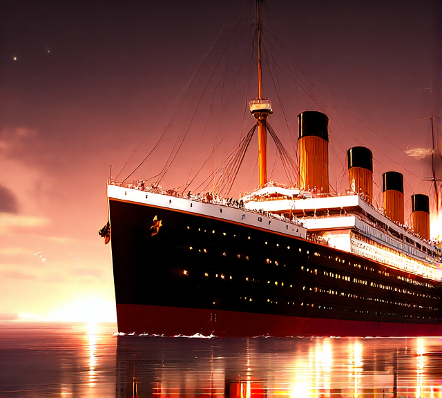

# Titanic-ML-App


This project uses the titanic machine learning from disaster data sets on *kaggle*.

# Problem statement
You are a data scientist that has been able to time travel back in time to the early 20th century. Using the survival data from the titanic disaster you are to construct a Machine learning model in order to predict who would or would not survive. Create a streamlit app to deploy your ML model to make it accessible to all potential passengers in an effort to save their lives. 

## Environment setup

First install `uv` using:
```bash
pip3 install uv 
```

Next create a virtual environment using:
```shell 
uv venv .venv --python 3.11
```

Activate the virtual environment.

For mac:
```shell
source .venv/bin/activate
```
For windows:
```shell
.venv\Scripts\activate
```

Install packages and dependencies using:
```shell
uv sync
```

